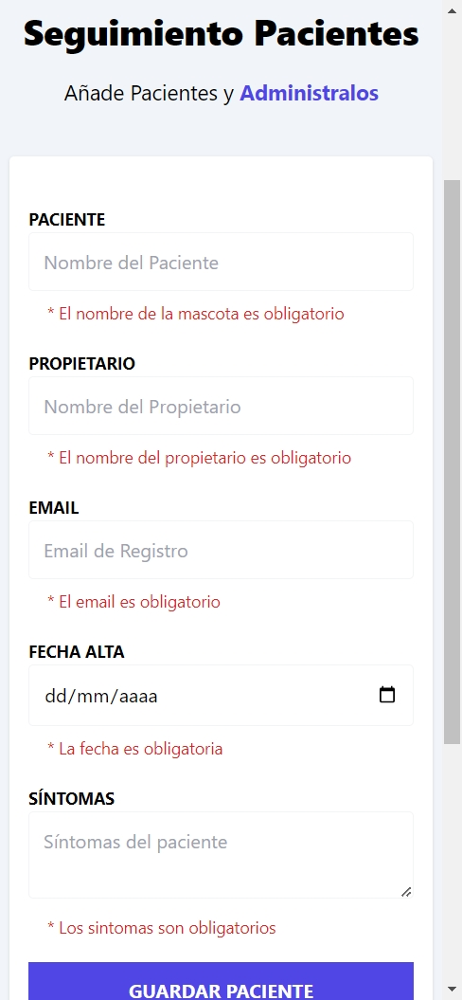
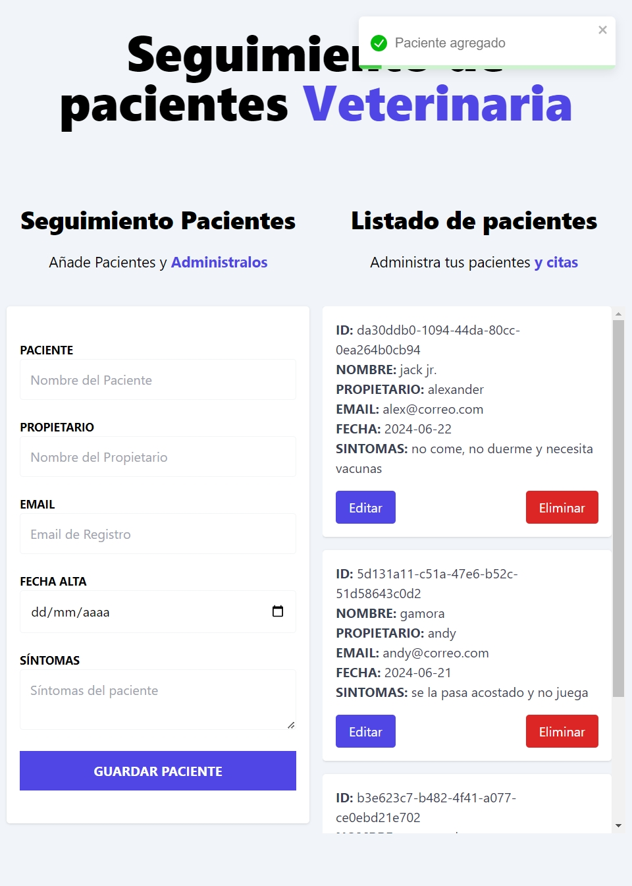
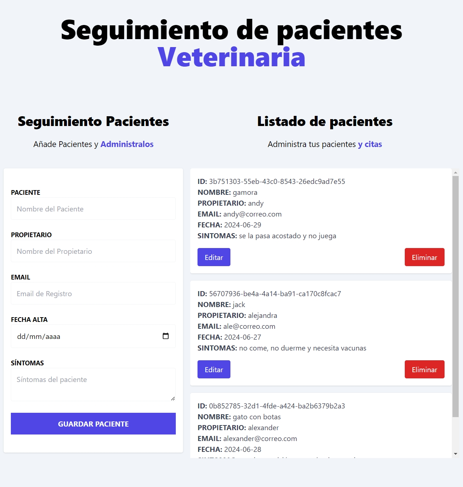

# Administrador de Pacientes Veterinaria

Aplicación para gestionar y dar seguimiento a los pacientes de una veterinaria. Desarrollada con React y TypeScript, utilizando Zustand para la gestión del estado y React Hook Form para el manejo de formularios.

## Herramientas de Desarrollo

* React: Desarrollo de la interfaz de usuario.
* TypeScript: Lenguaje de programación base.
* Tailwind CSS: Estilización de la aplicación.
* Zustand: Gestión del estado de la aplicación.
* React Hook Form: Manejo y validación de formularios.
* Vite: Bundler de la aplicación.

## Funcionalidades

* Alta de nuevos pacientes: Permite registrar nuevos pacientes en la veterinaria.
* Actualización de pacientes: Permite modificar la información de pacientes existentes.
* Eliminación de pacientes: Permite eliminar pacientes del registro.
* Persistencia de datos: Los datos se almacenan en localStorage para asegurar su persistencia.

## Enfoque de Desarrollo

* Componentes reutilizables y responsivos: La aplicación está diseñada para ser adaptable a diferentes tamaños de pantalla (móvil, tablet y desktop).
* Gestión del estado: Utiliza Zustand para un manejo eficiente del estado global de la aplicación.
* Formularios y validación: Implementados con React Hook Form para asegurar una gestión y validación adecuada de los datos ingresados.

## Vistas

1. Aplicación para móvil

1. Aplicación para tablet

3. Aplicación para desktop

